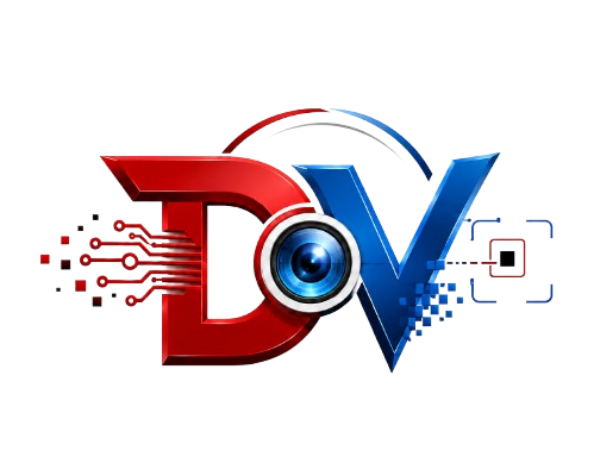

# DefexVision
An AI-powered defect detection system using YOLOv8, OpenCV
<p align="center">
  
</p>
<p align="center">
  
</p>
<h1 align="center">🖱️ Defex<span style="color:#e53935">Vision</span></h1>

<h3 align="center">An AI-powered defect detection system using YOLOv8 &amp; OpenCV</h3>

<p align="center">
  <b>AI-powered defect detection for computer mouse chips.</b>
</p>

<p align="center">
  
  
  
  
  
  
  
</p>

<p align="center">
  
</p>

> **Defex** (red) + **Vision** (blue) — upload a chip image, it is preprocessed
> with Python/OpenCV, then passed to a **YOLOv8** model which annotates every
> defect (IC, LED, Mouse-click, Mouse-scroll, Resistor, Capacitor defects).
>
> This repo is a **local web app**: anyone can download it and run it on their
> own machine (no deployment needed).

---

## 📋 Table of Contents

- [Tech Stack](#-tech-stack)
- [Quick Start — Run Locally](#-quick-start--run-locally)
  - [macOS / Linux](#macos--linux)
  - [Windows (Command Prompt)](#windows-command-prompt)
- [The Model](#-the-model)
- [Admin Panel](#-admin-panel)
- [Configuration (.env)](#-configuration-env)
- [How the Pipeline Works](#-how-the-pipeline-works)
- [Project Layout](#-project-layout)

---

## 🛠️ Tech Stack

Built with the requested Python stack only:

| Layer       | Technology                                        |
|-------------|---------------------------------------------------|
| 🖥️ Web app  | **Django** (rich frontend, ORM)                   |
| ⚙️ Inference| **Flask** microservice (loads your `yolo8m (1).pt`) |
| 🗄️ SQL      | SQLite (or PostgreSQL via `.env`)                 |
| 📦 NoSQL    | MongoDB (auto-fallback to local JSON store)       |
| 🔬 Processing| **Python** + OpenCV preprocessing pipeline       |

---

## 🚀 Quick Start — Run Locally

### Prerequisites

- **Python 3.9+** (download from [python.org](https://www.python.org/downloads/))
- A modern web browser

---

### 🍎 macOS / Linux

```bash
# 1. Set up the environment (creates .venv, installs deps, copies .env, migrates DB)
bash setup.sh

# 2. Run the app (starts Flask :5001 + Django :8000)
bash run.sh

# 3. Open the app
# http://localhost:8000
```

---

### 🪟 Windows (Command Prompt)

```bat
:: 1. Create & activate the virtual environment
python -m venv .venv
.venv\Scripts\activate

:: 2. Install dependencies
pip install -r requirements.txt
pip install ultralytics torch gdown

:: 3. Create .env
copy .env.example .env

:: 4. Download the model automatically
python download_model.py "https://drive.google.com/file/d/1OdxHVoHfdR44rsSokrHvtu1hLFiyhNEg/view?usp=sharing"

:: 5. Set up the database
python manage.py migrate

REM terminal 1:
python inference_api\app.py

REM terminal 2:
python manage.py runserver 0.0.0.0:8000

REM open http://localhost:8000
```

---

### ✅ Using the App

Open **http://localhost:8000**, go to **Scan**, upload a chip image.

> **Tip:** On the Scan page you can also click a **built-in sample image** to
> test the pipeline instantly without uploading your own photo.

> No MongoDB running? No problem — the NoSQL store automatically falls back to
> a local JSON document store (you'll see `backend: json` on the dashboard).

---

## 🤖 The Model

GitHub blocks files over 100 MB (and warns above 50 MB), so the trained model
is **not committed** (git-ignored). Two ways to add it:

### Option A — Auto-download from a link (recommended)

Google Drive / Dropbox / direct URL. Set in your `.env`:

```ini
MODEL_URL=https://drive.google.com/file/d/YOUR_FILE_ID/view?usp=sharing
MODEL_PATH=models/yolo8m (1).pt
```

Then `run.sh` (or `python download_model.py "$MODEL_URL"`) fetches it into
`models/`.

### Option B — Manual

Place the file at:

```
models/yolo8m (1).pt
```

To run **real** inference you also need:

```bash
pip install ultralytics torch
```

If the model isn't present, the app runs in **demo mode** — it still exercises
the whole pipeline with synthetic detections, so you can test the UI without a
model.

---

## 🔑 Admin Panel

```bash
python manage.py createsuperuser
```

Then visit `/admin/` to browse inspections and detected defects.

---

## ⚙️ Configuration (`.env`)

| Variable          | Default                  | Meaning                              |
|-------------------|--------------------------|--------------------------------------|
| `INFERENCE_MODE`  | `flask`                  | `flask` (real) or `demo` (synthetic) |
| `FLASK_API_URL`   | `http://127.0.0.1:5001`  | Flask inference endpoint (local)     |
| `FLASK_TIMEOUT`   | `180`                    | seconds to wait for Flask `/predict` |
| `MODEL_PATH`      | `models/yolo8m (1).pt`   | path to your weights                 |
| `MODEL_URL`       | *(empty)*                | auto-download the model from a link  |
| `MODEL_CONF`      | `0.25`                   | YOLO confidence threshold            |
| `MODEL_IOU`       | `0.45`                   | YOLO NMS IoU                         |
| `PREPROCESS_MODE` | `raw`                    | `raw` (feed original to model) or `enhanced` (crop/deskew) |
| `MONGO_URI` / `MONGO_DB` | local defexvision | NoSQL connection              |
| `DATABASE_*`      | SQLite                   | switch to PostgreSQL for production  |

> **Detectable defects** match the reference detector: `IC-defect`,
> `LED-defect`, `Mouse-click defect`, `Mouse-scrolldefect`,
> `Resistor-defect`, `capacitor-defect`.
>
> Boxes are **red** for defects and **green** for non-defects. Non-defects are
> drawn on the image but not listed in the SQL defect list.

---

## 🔄 How the Pipeline Works

```
Upload (image)
   │  Python + OpenCV
   ▼
Preprocess: auto-crop chip → denoise → CLAHE enhance → deskew → letterbox 640
   │
   ▼
Inference: Flask API → YOLOv8 (or demo) → detections [{class, conf, bbox}]
   │
   ├──▶ SQL (Inspection + DetectedDefect rows)
   ├──▶ NoSQL (analysis document: stages, timings, detections)
   └──▶ Annotated result images → shown in the UI
```

---

## 📁 Project Layout

```
defexvision/            Django project (settings, urls)
scanner/                Django app (models, views, admin)
  services/
    preprocess.py       OpenCV preprocessing pipeline
    inference.py        inference orchestration + rendering
    defects.py          defect taxonomy / colours / demo classes
    nosql_store.py      MongoDB + JSON-fallback document store
inference_api/          Flask microservice (loads the YOLO model)
models/                 ← drop yolo8m (1).pt here (git-ignored)
templates/ static/      rich frontend (dark UI, Defex red + Vision blue)
media/                  uploads, stage images, results (git-ignored)
```

---

<p align="center">
  Made with ❤️ for the quality inspection of mouse-chip assemblies.
</p>
